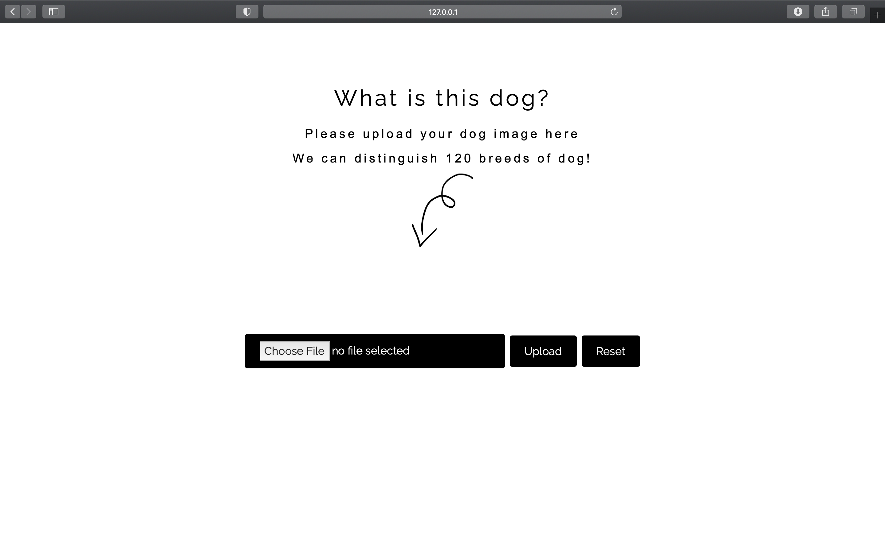

# DOG BREED CLASSIFICATION WEB APP

## DESCRIPTION

This project aims to identify different dog breeds in a web application using CNN algorithm combine with Flask.
We have experimented 4 differnt pre-trained models such as Xception, Inception-V3, InceptionResNet-V2, ResNet152-V2.
In the end, we chose the lightest and most accurate model deploy into web application.

We can identify 120 breeds of dogs by using [Stanford Dog Dataset].(http://vision.stanford.edu/aditya86/ImageNetDogs/main.html)
Here are some sample images:


## PACKAGES TO GET STARTED

Get [Stanford Dog Dataset](http://vision.stanford.edu/aditya86/ImageNetDogs/main.html)


### Before execute CNN models:
```
$ pip install keras
$ pip install tensorflow
$ pip install opencv-python
$ pip install Pillow
```

### Before execute the web app:

```
$ pip install keras
$ pip install tensorflow
$ pip install opencv-python
$ pip install Pillow
$ pip install bs4
$ pip install requests
$ pip install img2pdf
$ pip install html2image

py -3 -m venv venv
venv\bin\activate
$ pip install Flask
```

Please download the complete app execution file before testing the web app: 
https://drive.google.com/drive/folders/19W5z0nEwwmMKZyt76zqI15pdO4hzKBdv?usp=sharing

This APP file on google drive includes a .h5 file that can make our app predict the image smoothly, while the "CODE-APP" does not include the .h5 file since the upload limitation is 50MB.
Sorry for the inconvenience.


### To Execute the web app:
```
set FLASK_APP=app.py
$ env:FLASK_APP = "app.py"
$ env:FLASK_ENV = "development"
python -m flask run
```
### After running the execution code, please enter the website:
http://127.0.0.1:5000/

For more detail please look at [Flask Installation Page](https://flask.palletsprojects.com/en/2.1.x/installation/)

## EXECUTION STEPS FOR CNN TRAINING


1. Splitting Original dataset into training set and test set
2. Data Preprocessing
3. Setting up CNN pre-trained model
4. Setting learning rate and optimiser
5. Train the model with training set and validation set
6. Evaluate the model with test set

## CLASSIFICATION RESULT

Pre-trained Models | Accuracy | 
--- | --- | 
InceptionResNet-V2 | 90.70% | 
Xception | 88.82% | 
Inception-V3 | 86.73% |
ResNet152-V2 | 78.00% | 

## HOW THE WEB APP WORKS
1. Read through home page information and click the button to the image uplaod page
2. Upload the image with the dog you are curious about its breed
3. Get the identify result!


## APP RESULT
Home Page:


Image Upload Page:


Result Page:


